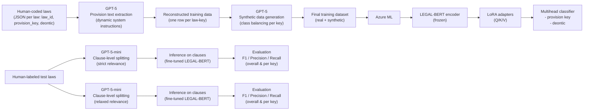

# LawCoding project

This repository is part of a larger project that's focused on automating the labeling of self-expression laws globally. It includes code for reconstructing training data from human coders (by using LLMs to identify relevant text excerpts), creating synthetic data due to imbalance, and fine-tuning a BERT model for classifying law texts across 300+ variables.

## Pipeline

