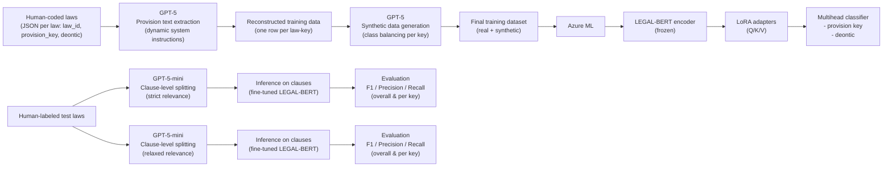

# LawCoding project

This repository is part of a larger project that's focused on automating the labeling of self-expression laws globally. The specific purpose of this labeling is to identify what specific rules are included (or explicitly excluded) in each law. We use general ADICO statements based on the institutional grammar approach to define general legal rules (253 in total) that differentiates between actors, topics, type, and conditionals. The repository includes code for reconstructing training data from human coders (by using LLMs to identify relevant text excerpts), creating synthetic data due to imbalance via an LLM, and fine-tuning a BERT model with LoRA adapters and a multihead classifier.

## Pipeline



The workflow begins with human-coded laws, where each law is annotated with provision keys and a binary deontic indicator capturing whether a rule is included or excluded. GPT-5 is then used to extract relevant text excerpts for each provision key, reconstructing a structured training dataset on a per law–key basis. To address class imbalance, GPT-5 also generates synthetic data, which is appended to create the final training dataset.

The training dataset is used to fine-tune a LEGAL-BERT model on Azure ML. The encoder is frozen, and LoRA adapters are applied to the attention layers, while a multihead classifier simultaneously predicts provision keys and deontic values. The modular architecture allows the model to leverage shared representations while optimizing separate objectives for each output head. This step ensures the model is capable of capturing the nuanced language of legal provisions while remaining robust to rare classes.

For evaluation, human-labeled test laws are passed through a clause-level splitting pipeline using GPT-5-mini, with separate splits for strict and relaxed relevance to ensure complete coverage. Each clause is then run through the fine-tuned LEGAL-BERT model to generate predictions, which are aggregated and compared against the original human annotations. Model performance is reported using F1, precision, and recall, both overall and by provision key. This pipeline provides a reproducible and interpretable workflow for scaling legal text annotation across hundreds of variables.

## Folder structure

```
LawCoding/
├── azureml/        # Files for cloud computing
│   └── configs/    # Job configs
│   └── environment/# Environment settings
│   └── scripts/    # Run scripts and modules
├── data/           # Raw and processed datasets
│   └── analysis/   # Results
├── outputs/        # Generated figures, pipeline diagrams
│   └── adapters/   # LoRA weights and multihead classifier
└── scripts/        # Run scripts and modules for local computing
```

Because some parts require significant computing power, we split the pipeline into local and cloud parts. The code for fine-tuning and inference can be found under the "azureml" folder.

In order to run the first part of the pipeline (reconstructing and processing the training data), run `training_prep_run.py`. This run script pulls in relevant modules from `training_prep_library.py` and outputs `training_data.jsonl` in the data folder (raw data not available on the public repo). To run the fine-tuning job on Azure, submit the `job.yaml` found in the parent directory, replacing the computing instance name. `test_prep_run.py` performs the text splitting and filtering on the test data, while `job_infer.yaml` should be used to execute the inference job on Azure, resulting in `test_predictions.jsonl`. Lastly, `test_merge.py` processes the predictions and merges them with the human-generated labels for analysis.